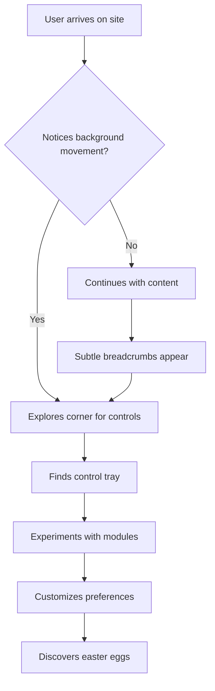
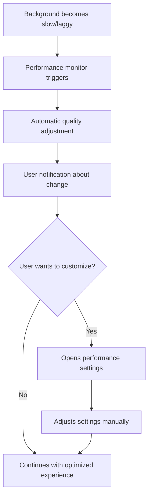

# Interactive Background System: UX Design Specification

## Executive Summary

This document provides comprehensive UX design specifications for the Phase 3 interactive background system. The design prioritizes **progressive disclosure**, **accessibility-first interactions**, and **delightful discovery** while maintaining the site's professional aesthetic and respecting user preferences.

## Design Principles

### 1. **Subtle by Default, Engaging by Choice**
- Background interactions should never overwhelm primary content
- Progressive enhancement allows users to discover advanced features organically
- Always respect user motion and accessibility preferences

### 2. **Accessible-First Design**
- All interactions must be keyboard navigable
- Provide meaningful feedback for screen readers
- Support high contrast and reduced motion preferences
- Ensure sufficient color contrast ratios (WCAG AA minimum)

### 3. **Performance-Conscious UX**
- Visual feedback adapts to device performance capabilities
- Graceful degradation maintains core functionality across all devices
- Smooth 60fps interactions or intelligent frame rate adaptation

### 4. **Discovery Through Play**
- Easter eggs emerge through natural exploration patterns
- Reward curiosity without creating confusion
- Balance discoverability with subtlety

## 1. Interactive Graph UX Design

### 1.1 Node Interaction Patterns

#### Visual States
```css
/* Node State Design Tokens */
:root {
  --node-default-size: 8px;
  --node-hover-size: 12px;
  --node-active-size: 14px;
  --node-drag-size: 16px;
  
  --node-default-opacity: 0.8;
  --node-hover-opacity: 1.0;
  --node-active-opacity: 1.0;
  --node-drag-opacity: 0.9;
  
  --node-border-default: 2px solid rgba(59, 130, 246, 0.5);
  --node-border-hover: 2px solid rgba(59, 130, 246, 0.8);
  --node-border-active: 3px solid rgba(59, 130, 246, 1.0);
  --node-border-drag: 3px solid rgba(16, 185, 129, 1.0);
  
  /* Reduced motion alternatives */
  --node-transition-normal: all 0.2s cubic-bezier(0.4, 0, 0.2, 1);
  --node-transition-reduced: all 0.1s ease-in-out;
}
```

#### Interaction Affordances

**1. Hover State**
- **Visual**: Gentle scale increase (8px → 12px), brightness boost
- **Timing**: 200ms cubic-bezier transition
- **Cursor**: `cursor: grab` to indicate draggability
- **Sound**: Optional subtle hover tone (user preference)

**2. Focus State (Keyboard Navigation)**
- **Visual**: Prominent focus ring matching site focus styles
- **Keyboard**: Tab navigation between nodes, Enter to "grab"
- **Screen Reader**: "Interactive node [X] of [Y]. Press Enter to grab, Escape to release"

**3. Drag State**
- **Visual**: Larger scale (16px), green border, slight transparency
- **Cursor**: `cursor: grabbing`
- **Physics**: Real-time spring physics with dampening
- **Constraints**: Respect canvas boundaries with gentle "bounce-back"

**4. Connection Highlighting**
- **Behavior**: On node hover, connected edges glow with matching color
- **Animation**: Subtle pulse effect travels along connected edges
- **Performance**: Optimized for 200+ node graphs

### 1.2 Physics and Movement

#### Spring Physics System
```typescript
interface SpringConfig {
  tension: number      // 150 (default), 100 (reduced motion)
  friction: number     // 12 (default), 15 (reduced motion)  
  mass: number         // 1 (default), 1.2 (mobile)
  precision: number    // 0.1 pixels
}

interface NodePhysics {
  // Natural movement patterns
  restPosition: Vector2D
  velocity: Vector2D
  acceleration: Vector2D
  
  // Interaction responses
  dragOffset: Vector2D
  magneticForce: number    // Attraction to cursor during drag
  repulsionRadius: number  // Personal space around other nodes
}
```

#### Movement Patterns
- **Gentle Drift**: Nodes naturally drift in slow, organic patterns
- **Magnetic Cursor**: During drag, nearby nodes show subtle attraction
- **Collision Avoidance**: Nodes maintain comfortable spacing using soft repulsion
- **Edge Tension**: Connected nodes maintain optimal distances

### 1.3 Visual Feedback Systems

#### Particle Effects
```typescript
interface ParticleSystem {
  // Interaction trails
  cursorTrail: {
    enabled: boolean           // Based on performance and preference
    particleCount: 5-15        // Adaptive based on device capability
    lifetime: 800ms            // Trail fade duration
    colors: [primary, accent]  // Theme-aware colors
  }
  
  // Node connection sparks
  connectionSparks: {
    trigger: 'nodeConnect' | 'edgeHover'
    duration: 600ms
    intensity: 'subtle' | 'medium' | 'high'  // Performance-based
  }
  
  // Discovery rewards
  easterEggBurst: {
    duration: 1200ms
    particleCount: 20-50
    colors: [gold, celebration]
  }
}
```

#### Layered Visual Hierarchy
1. **Background Layer**: Subtle grid or gradient foundation
2. **Edge Layer**: Connection lines with varying opacity based on relevance
3. **Node Layer**: Primary interactive elements
4. **Particle Layer**: Dynamic feedback effects
5. **UI Overlay**: Cursor indicators, tooltips, temporary feedback

### 1.4 Interaction Modes

#### Exploration Mode (Default)
- **Behavior**: Gentle physics simulation, hover effects active
- **Visual**: Soft, organic movement patterns
- **Performance**: Optimized for continuous rendering
- **Accessibility**: Full keyboard navigation support

#### Focus Mode (Triggered by Extended Interaction)
- **Trigger**: 3+ seconds of continuous interaction or double-click/tap
- **Behavior**: Increased physics responsiveness, enhanced visual feedback
- **Visual**: Brighter colors, more pronounced effects
- **Duration**: 30 seconds of inactivity returns to Exploration mode

#### Minimal Mode (Performance Fallback)
- **Trigger**: Performance monitor detects <30fps or user preference
- **Behavior**: Reduced animation complexity, static positions during idle
- **Visual**: Simplified rendering with essential feedback only
- **Accessibility**: All interaction patterns preserved

## 2. Module Selection & Control Interface Design

### 2.1 Enhanced Control Tray

Building on the existing ControlTray component with expanded functionality:

#### Visual Design Updates
```css
/* Enhanced Control Tray Styles */
.control-tray {
  /* Glassmorphism with better accessibility */
  background: rgba(255, 255, 255, 0.95);
  backdrop-filter: blur(12px) saturate(1.8);
  border: 1px solid rgba(255, 255, 255, 0.2);
  box-shadow: 
    0 8px 32px rgba(0, 0, 0, 0.08),
    0 4px 16px rgba(0, 0, 0, 0.04),
    inset 0 1px 0 rgba(255, 255, 255, 0.4);
  
  /* Dark mode adaptation */
  &[data-theme="dark"] {
    background: rgba(17, 24, 39, 0.95);
    border: 1px solid rgba(75, 85, 99, 0.3);
    box-shadow: 
      0 8px 32px rgba(0, 0, 0, 0.3),
      0 4px 16px rgba(0, 0, 0, 0.2),
      inset 0 1px 0 rgba(75, 85, 99, 0.2);
  }
}
```

#### Module Switcher Enhancement
- **Visual Preview**: Tiny animated preview of each module in dropdown
- **Performance Indicators**: Visual badges showing resource usage (Low/Medium/High)
- **Compatibility Badges**: WebGL, Mobile-Optimized, High-Performance indicators
- **Quick Actions**: Pin frequently used modules, recent modules section

#### Configuration Panels

**Per-Module Settings**
```typescript
interface ModuleConfigUI {
  // Performance Configuration
  quality: {
    type: 'slider'
    range: [0.25, 1.0]
    labels: ['Battery Saver', 'Balanced', 'High Quality']
    default: 'auto'  // Based on device capabilities
  }
  
  // Visual Customization
  colorTheme: {
    type: 'color-palette'
    presets: ['site-theme', 'blue-ocean', 'forest-green', 'sunset-orange']
    custom: boolean  // Allow custom color picker
  }
  
  // Interaction Sensitivity
  responsiveness: {
    type: 'slider'
    range: ['subtle', 'balanced', 'energetic']
    description: 'How dramatically the background responds to interactions'
  }
  
  // Physics Parameters (Advanced Users)
  physics: {
    collapsed: true  // Show only for power users
    springTension: number
    dampening: number
    gravity: number
  }
}
```

### 2.2 Module Discovery Interface

#### Smart Module Recommendations
```typescript
interface ModuleRecommendation {
  // Context-aware suggestions
  basedOnTime: string[]        // Different modules for different times of day
  basedOnPage: string[]        // Page-appropriate modules
  basedOnWeather: string[]     // Weather API integration (optional)
  basedOnUsage: string[]       // User's historical preferences
  
  // Performance-aware filtering
  deviceOptimized: string[]    // Modules optimized for current device
  networkConscious: string[]   // Lighter modules for slow connections
  
  // Accessibility-aware
  reducedMotion: string[]      // Static or minimal animation modules
  highContrast: string[]       // High contrast compatible modules
}
```

#### Module Categories
- **Ambient**: Subtle, continuous background effects (Gradient, Particles)
- **Interactive**: Respond to user input (Knowledge Graph, Interactive Shapes)
- **Reactive**: React to page content or scroll position
- **Seasonal**: Time or date-based themes
- **Experimental**: Cutting-edge features for early adopters

### 2.3 Onboarding Flow

#### First-Time User Experience
```typescript
interface OnboardingFlow {
  // Progressive disclosure over multiple visits
  visit1: {
    trigger: 'first-page-load'
    content: 'Subtle hint about background controls'
    duration: 3000  // Auto-dismiss
    position: 'top-right-corner'
  }
  
  visit2: {
    trigger: 'second-session'
    content: 'Keyboard shortcut introduction (Shift+~)'
    interactive: true  // User must acknowledge
  }
  
  visit3: {
    trigger: 'after-first-interaction'
    content: 'Module customization options'
    timing: 'after-user-opens-controls'
  }
}
```

## 3. Easter Egg Discovery UX

### 3.1 Discovery Patterns

#### Breadcrumb System
```typescript
interface DiscoveryBreadcrumb {
  // Subtle visual hints
  visual: {
    type: 'shimmer' | 'glow' | 'particle-trail'
    frequency: 'rare'  // Appears ~5% of interactions
    duration: 1500     // Brief enough to question if it was real
    opacity: 0.3       // Very subtle
  }
  
  // Progressive revelation
  progression: {
    stage1: 'curious-pattern-emerges'     // User notices something
    stage2: 'pattern-becomes-clearer'     // Reproducible pattern
    stage3: 'discovery-moment'            // Easter egg unlocked
  }
}
```

#### Discovery Triggers
1. **Konami Code**: Classic gaming reference for tech-savvy users
2. **Extended Interaction**: 30+ seconds of continuous graph manipulation
3. **Pattern Recognition**: Specific sequences of module switches
4. **Time-Based**: Special effects during certain times/dates
5. **Cumulative Usage**: Unlocked after total interaction milestones
6. **Hidden Click Zones**: Invisible areas that respond to exploration

### 3.2 Achievement System

#### Achievement Categories
```typescript
interface AchievementSystem {
  // Explorer Achievements
  explorer: {
    'first-steps': 'Discovered background controls'
    'module-hopper': 'Tried 5 different modules'
    'customizer': 'Modified module settings'
    'performance-guru': 'Optimized settings for your device'
  }
  
  // Interaction Achievements  
  interaction: {
    'node-whisperer': 'Interacted with 100+ nodes'
    'physics-master': 'Achieved perfect node arrangement'
    'connection-maker': 'Discovered hidden node connections'
  }
  
  // Time-Based Achievements
  temporal: {
    'night-owl': 'Used site after midnight'
    'early-bird': 'Used site before 6 AM'
    'loyal-visitor': 'Returned 7 days in a row'
  }
  
  // Secret Achievements (Revealed only after discovery)
  secret: {
    'konami-master': 'Found the classic code'
    'easter-hunter': 'Discovered all hidden features'
    'dev-mode': 'Unlocked developer insights'
  }
}
```

#### Discovery Feedback
- **Visual Celebration**: Confetti burst or particle explosion
- **Sound Feedback**: Optional celebratory sound (user preference)
- **Persistent Progress**: Achievement badges in settings panel
- **Social Sharing**: Generate shareable achievement images
- **Unlocked Features**: New modules, color schemes, or settings

### 3.3 Progressive Disclosure Strategy

#### Discovery Difficulty Curve
```
Difficulty Level: Easy → Medium → Hard → Expert → Legendary

Easy (90% users):    Basic control discovery, first module switch
Medium (50% users):  Module customization, keyboard shortcuts  
Hard (20% users):    Advanced settings, performance optimization
Expert (5% users):   Hidden modules, secret configurations
Legendary (1%):      Developer modes, debug visualizations
```

## 4. Accessibility-First Interaction Design

### 4.1 Keyboard Navigation

#### Complete Keyboard Support
```typescript
interface KeyboardNavigation {
  // Global shortcuts
  'Shift + ~': 'cycle-modules'
  'Shift + Ctrl + B': 'toggle-background'
  'Escape': 'close-all-dialogs'
  
  // Graph navigation
  'Tab': 'navigate-between-nodes'
  'Shift + Tab': 'navigate-backwards'
  'Enter': 'select-grab-node'
  'Space': 'activate-node'
  'Escape': 'release-grabbed-node'
  
  // Arrow key movement (when node is grabbed)
  'ArrowLeft': 'move-node-left'
  'ArrowRight': 'move-node-right'  
  'ArrowUp': 'move-node-up'
  'ArrowDown': 'move-node-down'
  
  // Batch operations (power users)
  'Ctrl + A': 'select-all-nodes'
  'Ctrl + Shift + R': 'reset-graph-layout'
}
```

#### Focus Management
- **Visual Focus Indicators**: Clear, high-contrast focus rings
- **Focus Trapping**: Modal dialogs properly trap focus
- **Focus Restoration**: Return focus to trigger element after modal close
- **Skip Navigation**: Allow users to bypass complex interactive areas

### 4.2 Screen Reader Support

#### ARIA Implementation
```html
<!-- Interactive Graph ARIA Structure -->
<div 
  role="application" 
  aria-label="Interactive knowledge graph"
  aria-describedby="graph-instructions"
>
  <div id="graph-instructions" class="sr-only">
    Navigate between nodes using Tab key. Press Enter to grab a node, 
    arrow keys to move it, and Escape to release. 
    Press Shift+~ to switch background modules.
  </div>
  
  <div role="group" aria-label="Graph nodes">
    <button 
      role="button"
      aria-label="Node: JavaScript - Connected to 3 other topics"
      aria-describedby="node-js-details"
      tabindex="0"
      data-node-id="javascript"
    >
      <!-- Node visual content -->
    </button>
  </div>
  
  <div role="status" aria-live="polite" id="interaction-status">
    <!-- Dynamic updates for screen readers -->
  </div>
</div>
```

#### Dynamic Announcements
- **Node Selection**: "Selected node: [topic name]. Connected to [X] other topics."
- **Drag Operations**: "Moving [topic name]. Current position: [description]."
- **Module Changes**: "Switched to [module name]. [Brief description of visual change]."
- **Easter Egg Discovery**: "Achievement unlocked: [achievement name]!"

### 4.3 Reduced Motion Support

#### Motion Preference Detection
```css
@media (prefers-reduced-motion: reduce) {
  /* Disable complex animations */
  .node-transition { transition: none; }
  .particle-system { display: none; }
  .physics-simulation { animation-duration: 0s; }
  
  /* Provide alternative feedback */
  .interaction-feedback {
    /* Use color/opacity changes instead of movement */
    background-color: var(--highlight-color);
    opacity: 0.8;
  }
}

@media (prefers-reduced-motion: no-preference) {
  /* Full animation experience */
  .enhanced-animations { animation-duration: var(--normal-duration); }
}
```

#### Alternative Interaction Patterns
- **Static Highlighting**: Replace movement with color/opacity changes
- **Instant Feedback**: Remove transition delays for immediate response
- **Pattern Alternatives**: Use texture/pattern changes instead of motion
- **Progressive Enhancement**: Layer motion on top of functional base

### 4.4 High Contrast Support

#### Contrast Mode Detection
```css
@media (prefers-contrast: high) {
  :root {
    /* Enhanced contrast ratios */
    --node-border: 3px solid #000;
    --node-background: #fff;
    --node-text: #000;
    --edge-color: #000;
    --focus-ring: 3px solid #0066cc;
    
    /* Remove subtle effects that may not be visible */
    --backdrop-blur: none;
    --box-shadow: 2px 2px 4px rgba(0,0,0,0.8);
  }
  
  /* Ensure all interactive elements are clearly defined */
  .interactive-element {
    border: 2px solid currentColor;
    background: var(--background);
  }
}
```

## 5. Cross-Device Experience Design

### 5.1 Touch vs Mouse/Keyboard Adaptation

#### Touch Interaction Patterns
```typescript
interface TouchInteractions {
  // Single touch gestures
  tap: {
    target: 'node-selection'
    feedback: 'immediate-visual-confirmation'
    duration: 100  // Quick response for mobile users
  }
  
  // Long press for additional actions
  longPress: {
    duration: 500
    action: 'context-menu' | 'drag-mode'
    feedback: 'haptic-vibration' // If supported
  }
  
  // Multi-touch gestures
  pinch: {
    action: 'zoom-graph'
    sensitivity: 'adaptive'  // Based on screen size
    limits: [0.5, 3.0]  // Zoom range
  }
  
  pan: {
    action: 'move-entire-graph'
    momentum: true  // Natural scroll momentum
    boundaries: 'elastic'  // Bounce at edges
  }
}
```

#### Responsive Hit Targets
```css
/* Mobile-First Touch Targets */
.touch-target {
  min-width: 44px;   /* iOS guideline */
  min-height: 44px;
  padding: 12px;
}

/* Tablet Adaptations */
@media (min-width: 768px) and (pointer: coarse) {
  .touch-target {
    min-width: 32px;
    min-height: 32px;
    padding: 8px;
  }
}

/* Desktop/Precise Input */
@media (pointer: fine) {
  .touch-target {
    min-width: 24px;
    min-height: 24px;
    padding: 4px;
  }
}
```

### 5.2 Performance-Based Adaptation

#### Device Capability Detection
```typescript
interface DeviceCapabilities {
  // Hardware detection
  memory: number              // navigator.deviceMemory || 4
  cores: number              // navigator.hardwareConcurrency || 4
  connection: string         // NetworkInformation API
  
  // Performance benchmarking
  renderingCapability: 'low' | 'medium' | 'high'
  frameRateTarget: 30 | 60
  
  // User preferences
  batteryLevel: number       // Battery API when available
  powerMode: 'low-power' | 'balanced' | 'performance'
}

interface AdaptiveConfiguration {
  low: {
    nodeCount: 25
    particleEffects: false
    complexTransitions: false
    renderingStrategy: 'canvas2d'
  }
  
  medium: {
    nodeCount: 100
    particleEffects: true
    complexTransitions: true
    renderingStrategy: 'webgl'
  }
  
  high: {
    nodeCount: 200
    particleEffects: true
    complexTransitions: true
    renderingStrategy: 'webgl2'
  }
}
```

### 5.3 Responsive Layout Patterns

#### Mobile-Specific Adaptations
- **Module Switcher**: Bottom sheet instead of dropdown for easier thumb access
- **Control Tray**: Slide-up panel optimized for one-handed use
- **Node Interaction**: Larger touch targets with improved visual feedback
- **Performance**: Automatic low-power mode detection and optimization

#### Tablet Optimizations
- **Hybrid Interactions**: Support both touch and mouse/trackpad simultaneously
- **Canvas Sizing**: Optimal balance between detail and performance
- **UI Scaling**: Adaptive interface sizing based on screen density

#### Desktop Enhancements  
- **Precision Controls**: Fine-grained settings accessible via right-click
- **Keyboard Shortcuts**: Comprehensive keyboard navigation
- **Multiple Monitors**: Respect system display preferences
- **High-DPI**: Crisp rendering on retina and 4K displays

## 6. User Journey Maps & Personas

### 6.1 Primary Personas

#### 1. The Explorer (40% of users)
**Profile**: Curious about interactive features, enjoys discovery
**Goals**: Find all hidden features, understand how things work
**Pain Points**: Frustrated by overly hidden features
**Journey**:
1. **Discover**: Notice subtle movement in background
2. **Investigate**: Find control tray through exploration
3. **Experiment**: Try different modules and settings
4. **Master**: Unlock advanced features and easter eggs
5. **Share**: Show discoveries to others

#### 2. The Professional (35% of users)  
**Profile**: Focused on content, wants minimal distraction
**Goals**: Access site content efficiently, occasional background interest
**Pain Points**: Animations that interfere with reading
**Journey**:
1. **Focus**: Primary attention on site content
2. **Notice**: Peripheral awareness of background activity
3. **Configure**: Quick setting adjustment to preferred level
4. **Ignore**: Background becomes comfortable ambient presence

#### 3. The Accessibility User (15% of users)
**Profile**: Uses assistive technologies, specific accessibility needs
**Goals**: Full access to site functionality without barriers
**Pain Points**: Inaccessible interactive elements
**Journey**:
1. **Navigate**: Screen reader announces interactive elements clearly
2. **Understand**: Clear descriptions of visual effects and changes
3. **Control**: Full keyboard access to all features
4. **Customize**: Adjust settings for optimal experience

#### 4. The Developer (10% of users)
**Profile**: Technical background, interested in implementation
**Goals**: Understand architecture, find technical easter eggs
**Pain Points**: Lack of technical documentation or insights
**Journey**:
1. **Analyze**: Inspect implementation and performance
2. **Experiment**: Test edge cases and performance limits  
3. **Discover**: Find developer-specific easter eggs
4. **Learn**: Gain insights for own projects

### 6.2 Experience Flow Mapping

#### Primary Flow: Background Discovery


#### Secondary Flow: Performance Optimization


### 6.3 Success Metrics

#### Engagement Metrics
- **Discovery Rate**: % of users who find background controls (Target: 60%)
- **Module Usage**: Average modules tried per session (Target: 2.3)
- **Customization Rate**: % of users who modify settings (Target: 25%)
- **Return Engagement**: Users who re-engage with background on return visits (Target: 40%)

#### Performance Metrics
- **Frame Rate**: Maintain 60fps for 95% of interactions
- **Load Time Impact**: <500ms additional page load time
- **Memory Usage**: <50MB additional memory usage
- **Battery Impact**: <10% additional battery drain on mobile

#### Accessibility Metrics  
- **Keyboard Navigation**: 100% of features accessible via keyboard
- **Screen Reader**: Zero critical accessibility violations
- **Reduced Motion**: Full functionality with animations disabled
- **High Contrast**: All visual elements pass WCAG AA standards

## Implementation Priority

### Phase 1: Core Interactive Graph UX
1. Node interaction patterns with spring physics
2. Keyboard navigation and focus management
3. Basic screen reader support
4. Performance-based rendering adaptation

### Phase 2: Enhanced Module Interface
1. Improved control tray with configuration panels
2. Module recommendation system
3. Onboarding flow for new users
4. Cross-device interaction optimization

### Phase 3: Discovery & Easter Eggs
1. Achievement system implementation
2. Easter egg triggers and rewards
3. Progressive disclosure mechanics
4. Social sharing features

### Phase 4: Advanced Accessibility
1. Complete ARIA implementation
2. Advanced keyboard shortcuts
3. Voice control support (experimental)
4. Custom accessibility preferences

This comprehensive UX specification provides the foundation for creating an engaging, accessible, and performance-conscious interactive background system that enhances rather than distracts from the site's primary content.