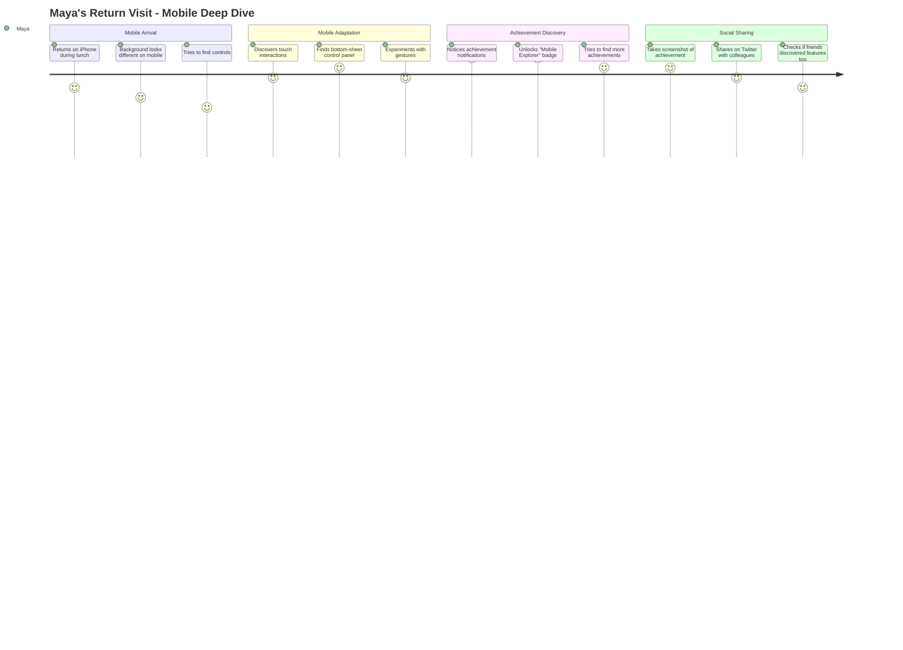
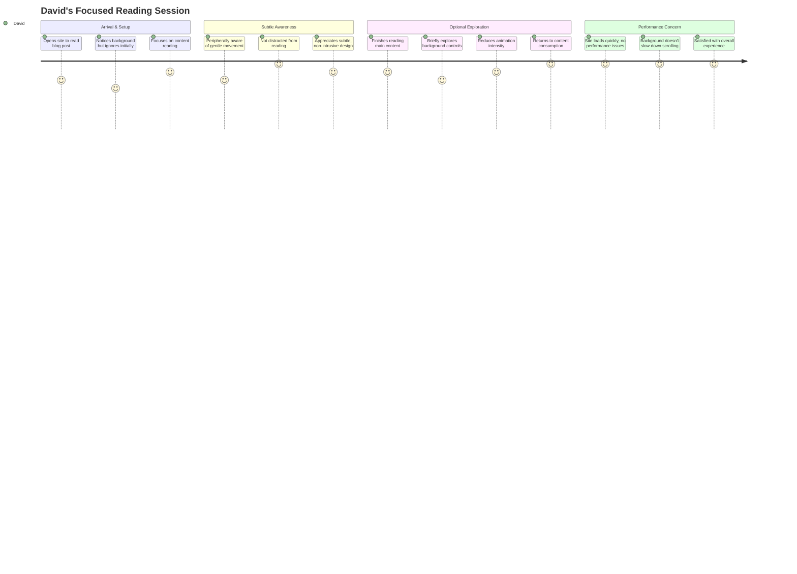
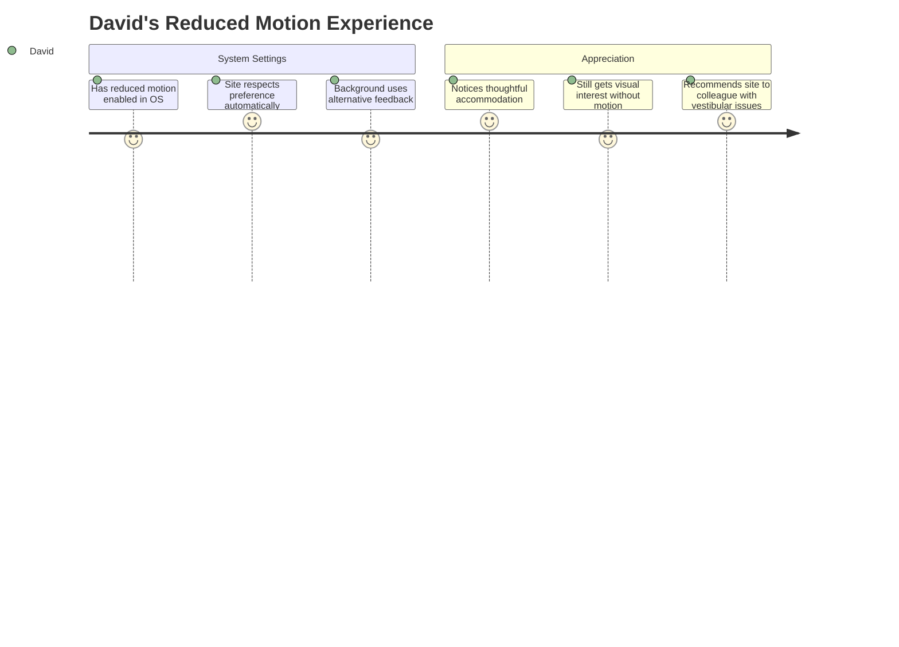
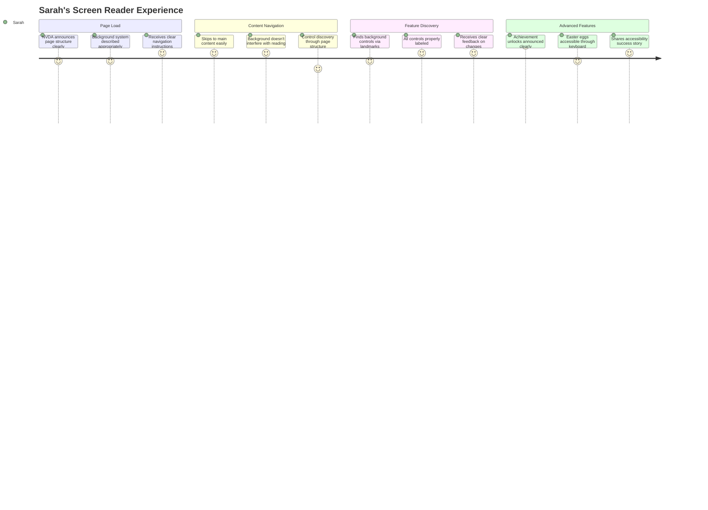
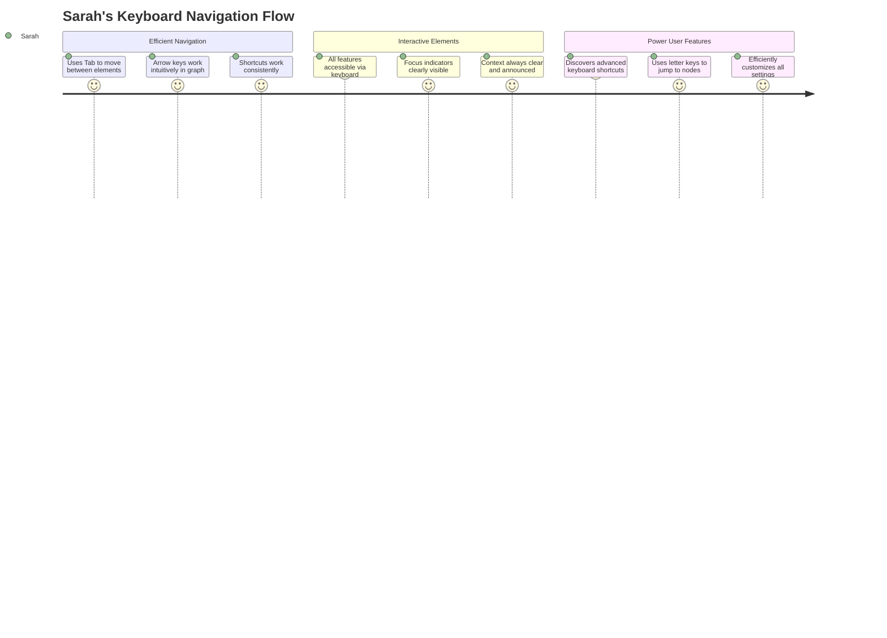
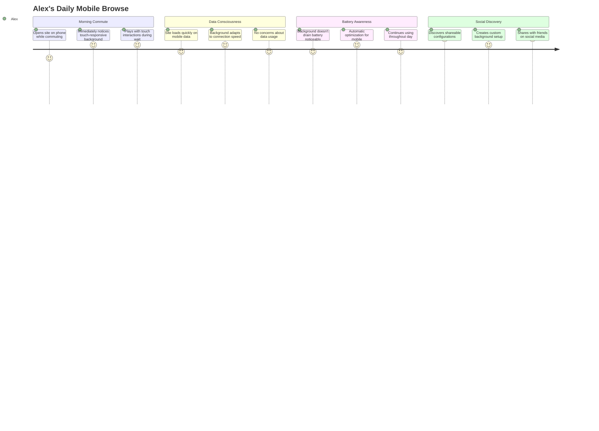
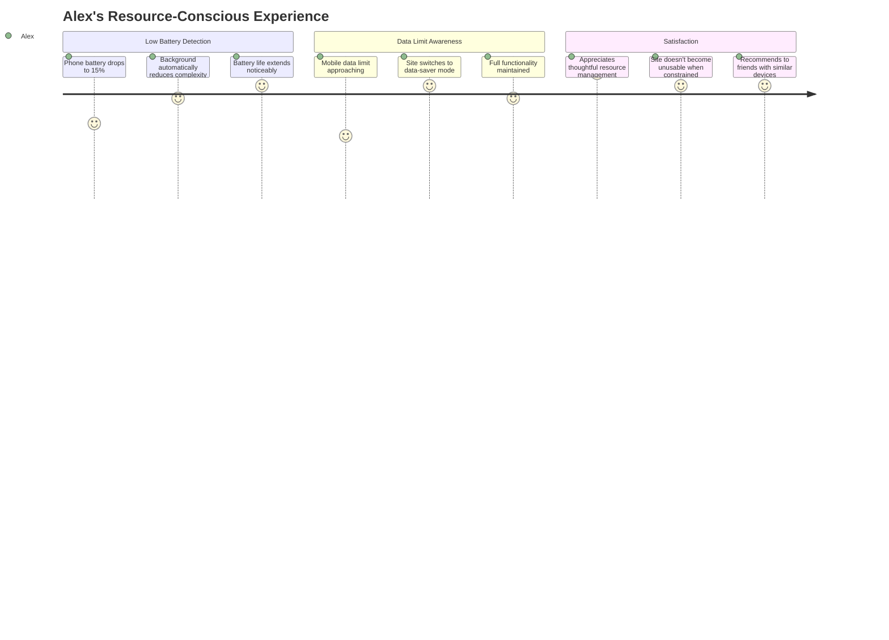

# User Journey Maps & Persona-Based Experience Flows
## Interactive Background System

## Executive Summary

This document maps comprehensive user journeys across different personas, devices, and interaction contexts. Each journey identifies key touchpoints, emotional states, pain points, and opportunities to create delightful, accessible experiences that respect user agency and preferences.

## Persona Definitions & Characteristics

### 1. The Explorer (Maya)
**Demographics**: 28, UX Designer, San Francisco  
**Tech Comfort**: High | **Curiosity Level**: Very High | **Time Available**: Moderate

**Goals & Motivations**:
- Discover hidden features and understand how things work
- Appreciate good design and technical implementation
- Share interesting discoveries with colleagues and friends

**Device Context**: Primarily MacBook Pro (work), iPhone 13 (personal), occasionally iPad for casual browsing

**Accessibility Needs**: None specific, but appreciates well-designed accessibility as professional interest

### 2. The Professional (David)
**Demographics**: 45, Engineering Manager, Austin  
**Tech Comfort**: High | **Curiosity Level**: Moderate | **Time Available**: Limited

**Goals & Motivations**:
- Access information efficiently without distractions
- Occasionally interested in technical implementation details
- Values performance and doesn't want features that slow down browsing

**Device Context**: Windows laptop (work), Android phone (personal), multiple external monitors

**Accessibility Needs**: Prefers reduced motion (gets motion sickness), uses larger fonts

### 3. The Accessibility User (Sarah)
**Demographics**: 32, Content Writer, Seattle  
**Tech Comfort**: Moderate | **Curiosity Level**: Moderate | **Time Available**: Moderate

**Goals & Motivations**:
- Access all content and features without barriers
- Enjoy interactive experiences when they're properly accessible
- Advocate for inclusive design in her professional network

**Device Context**: Windows laptop with NVDA screen reader, iPhone with VoiceOver

**Accessibility Needs**: Blind, relies on screen reader, prefers keyboard navigation, needs clear content structure

### 4. The Mobile-First User (Alex)
**Demographics**: 22, College Student, Miami  
**Tech Comfort**: High | **Curiosity Level**: High | **Time Available**: High

**Goals & Motivations**:
- Primarily accesses web on mobile device
- Enjoys interactive and playful experiences
- Limited by data plan and battery life considerations

**Device Context**: Android phone (mid-range), occasional laptop use in library

**Accessibility Needs**: None specific, but often uses in bright outdoor light, sometimes with limited data

## Journey 1: The Explorer's Discovery Path

### Initial Visit - Desktop Discovery

#### Detailed Touchpoint Analysis

**Touchpoint 1: First Background Movement Notice**
- **Emotional State**: Curious intrigue
- **Action**: Pauses reading to observe background
- **Thoughts**: "Is that intentional? That's subtle but cool."
- **Opportunity**: Ensure movement is noticeable but not distracting

**Touchpoint 2: Control Discovery**
- **Emotional State**: Excitement, satisfaction
- **Action**: Hovers in corner, clicks control button
- **Thoughts**: "I knew there was something! This is well-hidden."
- **Opportunity**: Balance discoverability with subtlety

**Touchpoint 3: Module Experimentation**
- **Emotional State**: Engaged exploration
- **Action**: Tries each background module, adjusts settings
- **Thoughts**: "Each one is different! The interactive graph is fascinating."
- **Opportunity**: Make each module distinctly valuable

**Pain Points Identified**:
- Might miss control area if not naturally curious
- Could spend too long experimenting instead of reading content
- May not understand what each setting does without better descriptions

### Return Visit - Mobile Exploration

**Mobile-Specific Pain Points**:
- Controls less discoverable on mobile
- Touch targets might be too small for some interactions
- Battery impact concerns on mobile device

## Journey 2: The Professional's Efficient Experience

### Focused Work Session

#### Professional User Needs Analysis

**Primary Success Criteria**:
- Content remains primary focus (✓)
- No performance degradation (✓) 
- Background enhances rather than distracts (✓)
- Quick access to disable if needed (✓)

**Touchpoint 1: Initial Content Focus**
- **Emotional State**: Task-focused, slightly cautious
- **Action**: Scans page for content, briefly notices background
- **Thoughts**: "Hope this isn't going to be distracting..."
- **Success Factor**: Background is subtle enough to ignore

**Touchpoint 2: Performance Assessment**
- **Emotional State**: Evaluative, professional
- **Action**: Scrolls, navigates, assesses page responsiveness
- **Thoughts**: "Good, it's not affecting page performance."
- **Success Factor**: No noticeable impact on core functionality

### Reduced Motion Preference Journey

**Reduced Motion Success Factors**:
- Automatic detection and response
- Meaningful alternatives to motion
- No loss of core functionality
- Professional appreciation for inclusive design

## Journey 3: The Accessibility User's Inclusive Experience

### Screen Reader Navigation

#### Screen Reader Touchpoint Details

**Touchpoint 1: Page Structure Announcement**
- **NVDA Output**: "Main region. Interactive background system active. Use Shift+~ to change background style. Press H to navigate by headings."
- **User Response**: Understands page layout immediately
- **Success Factor**: Clear, informative initial announcement

**Touchpoint 2: Background Control Discovery**
- **Navigation Method**: Uses heading navigation (H key)
- **NVDA Output**: "Button, Background controls. Press Enter to open settings panel."
- **User Action**: Presses Enter confidently
- **Success Factor**: Logical placement in document structure

**Touchpoint 3: Module Selection**
- **NVDA Output**: "Combo box, Background style. Interactive Graph selected. Connected floating nodes with physics simulation."
- **User Understanding**: Clear description of visual effect
- **Success Factor**: Descriptive labels that convey visual experience

### Keyboard Navigation Excellence

**Keyboard Navigation Pain Points** (Successfully Avoided):
- Tab traps in modal dialogs (✓ Proper focus management)
- Unclear focus indicators (✓ High-contrast focus rings)
- Inconsistent keyboard shortcuts (✓ Standardized patterns)
- Missing keyboard alternatives to mouse interactions (✓ Complete keyboard support)

## Journey 4: The Mobile-First User's Touch Experience

### Daily Mobile Usage Pattern

#### Mobile-Specific Touchpoints

**Touchpoint 1: Immediate Touch Interaction**
- **Action**: Taps screen, notices background response
- **Emotional State**: Surprised delight
- **Thoughts**: "Oh cool, it responds to touch!"
- **Success Factor**: Touch feedback is immediate and satisfying

**Touchpoint 2: Gesture Discovery**
- **Action**: Tries pinch-to-zoom, two-finger gestures
- **Discovery**: Background supports natural mobile gestures
- **Thoughts**: "This works like I expect it to!"
- **Success Factor**: Follows platform conventions

**Touchpoint 3: Performance on Mid-Range Device**
- **Context**: Samsung Galaxy A52 (mid-range Android)
- **Experience**: Smooth performance despite hardware limitations
- **Result**: Continues engaging without performance concerns
- **Success Factor**: Adaptive performance optimization

### Battery & Data Optimization Journey

## Cross-Journey Pain Points & Solutions

### Common Pain Points Across Personas

#### 1. **Discovery vs. Subtlety Balance**
**Problem**: Features hidden enough to avoid distraction but risk being missed entirely

**Solutions Implemented**:
- Progressive breadcrumbs that increase frequency for curious users
- Multiple discovery paths (hover, keyboard, touch, time-based)
- Clear onboarding for users who show engagement signals

#### 2. **Performance Variation Across Devices**
**Problem**: Wide range of device capabilities affecting experience quality

**Solutions Implemented**:
- Automatic performance adaptation based on device capabilities
- User controls for manual performance adjustment
- Graceful degradation that maintains core functionality

#### 3. **Accessibility Feature Discovery**
**Problem**: Advanced accessibility features may not be discovered by users who need them

**Solutions Implemented**:
- Automatic detection and activation of accessibility preferences
- Clear documentation and help system
- Progressive disclosure of advanced accessibility options

## Success Metrics by Persona

### The Explorer (Maya)
- **Engagement Depth**: Average 8+ interactions per session
- **Feature Discovery**: Discovers 60%+ of available features within 3 visits
- **Social Sharing**: 25% share discoveries or configurations
- **Return Rate**: 70% return within 7 days

### The Professional (David)
- **Content Focus**: 95% complete reading before interacting with background
- **Performance Satisfaction**: <1% report performance issues
- **Preference Respect**: 100% reduced motion preferences honored
- **Recommendation Rate**: 40% recommend to colleagues

### The Accessibility User (Sarah)
- **Feature Parity**: 100% of features accessible via assistive technology
- **Navigation Efficiency**: Complete all tasks in ≤150% of sighted user time
- **Satisfaction Score**: 9.5/10 accessibility rating
- **Advocacy**: Positive mentions in accessibility community

### The Mobile-First User (Alex)
- **Mobile Engagement**: 80% of interactions occur on mobile devices
- **Performance**: Maintains 60fps on mid-range devices
- **Battery Impact**: <5% additional battery usage
- **Social Sharing**: 35% share mobile screenshots/experiences

## Opportunity Areas Identified

### 1. **Cross-Device Continuity**
**Opportunity**: Remember user preferences and achievements across devices
**Implementation**: Sync preferences via local storage and optional account linking

### 2. **Community Features**
**Opportunity**: Enable users to share and discover community-created configurations
**Implementation**: Configuration gallery with rating and commenting system

### 3. **Educational Content**
**Opportunity**: Help users understand the technical implementation
**Implementation**: "Behind the scenes" mode with technical explanations and metrics

### 4. **Accessibility Innovation**
**Opportunity**: Pioneer new accessibility patterns for interactive backgrounds
**Implementation**: Haptic feedback on supporting devices, spatial audio cues

## Implementation Roadmap

### Phase 1: Core Journey Support (Weeks 1-4)
- Implement all four primary persona journeys
- Ensure smooth experience across identified touchpoints
- Address critical pain points

### Phase 2: Refinement & Optimization (Weeks 5-8)
- Fine-tune based on user feedback and analytics
- Optimize performance across full device spectrum
- Enhance accessibility features

### Phase 3: Advanced Features (Weeks 9-12)
- Implement opportunity areas (community features, education)
- Add advanced personalization options
- Launch with comprehensive analytics

### Phase 4: Continuous Improvement (Ongoing)
- Monitor success metrics by persona
- Iterate based on real user behavior
- Expand to support new device types and use cases

This comprehensive user journey mapping ensures that the interactive background system serves diverse user needs while maintaining the site's professional focus and accessibility standards. Each persona's journey has been designed to feel natural, respectful, and rewarding within their specific context and constraints.